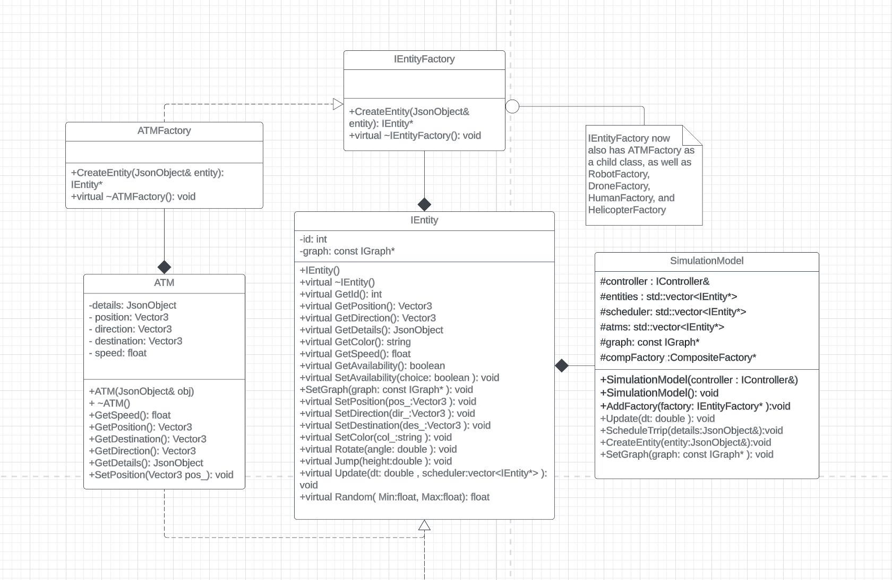
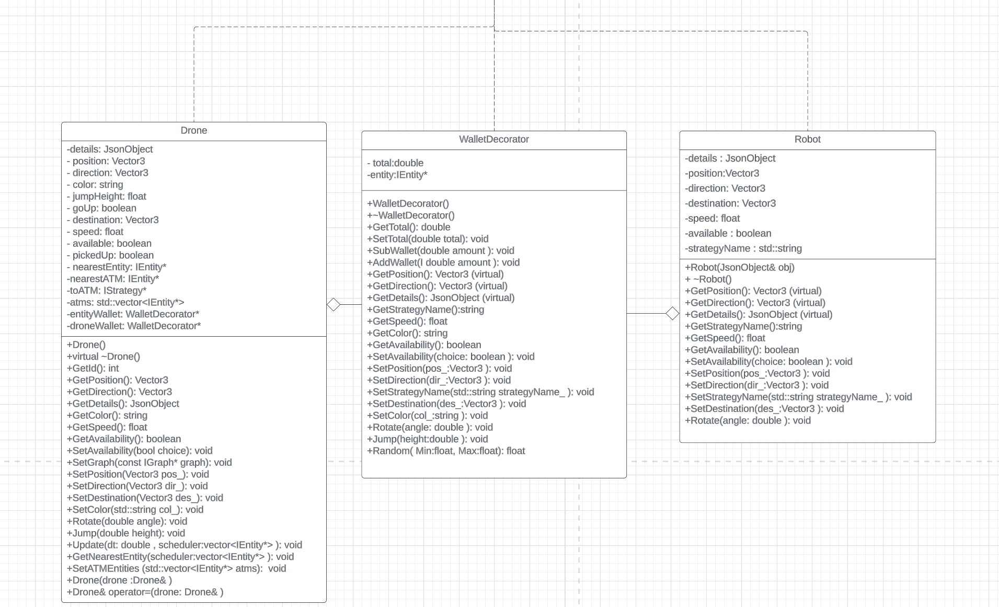

# Drone Simulation

Marwa Osman, Israa Mohamed

osman320, moha1433

Project Overview:

This project is a drone simulation. The simulation takes place at the University of Minnesota campus and there are multiple entities spread throughout the campus. There are two pages for the user to interact with. One shows the campus simulation and a drop down menu to choose which entity the user wants to focus the view on. The other is the schedule page and on this page, the user schedules trips for robot entities. 

To run the simulation, enter the following into the command line: 

./build/bin/transit_service 8081 apps/transit_service/web/

Then go to the pages http://127.0.0.1:8081 to see the simulation and http://127.0.0.1:8081/schedule.html to schedule a trip. On the schedule page, give the robot a name, choose which strategy it should use to get to its destination, plot two points on the campus map, and hit the schedule button to schedule a trip. The name and coordinates of the position and destination of the robot will then be displayed under “Trips:” on the right side of the page. 

Once a trip is scheduled, a new robot entity will be created at the chosen position on the campus simulation. The drone will then move towards the robot using a beeline strategy. Once the drone reaches the robot, it will pick it up and take it to its destination using the user’s chosen strategy. If there is another robot scheduled and ready to be picked up, the robot will then move to that robot and so on. There is a human entity and helicopter entity in the simulation. There is an “Add Human” button on the schedule page that can be used to add another human entity to the simulation. The humans and helicopters are not scheduled and move around to random destinations while the simulation is running. 

New Feature:

We added a way for the robots to pay for the scheduled trips. We added four atm entities throughout the simulation and we added wallets using the decorator design pattern. When a trip is scheduled, the robot and drone start off with a base amount of $100 in their wallets. The drone will move to the robot and then the price of the trip will be determined. If the robot has enough money for the trip, it will be picked up by the drone and move to the destination like normal. However, if the robot doesn’t have enough money for the trip, it will move or “walk” to the nearest ATM on its own. Once it gets to the atm, $100 will be added to its wallet. If the new balance is enough to cover the trip, the drone will move to where the robot is and continue the trip to the destination. Once they reach the destination, the robot’s balance will be deducted by the price and that amount will be added to the drone’s balance. In the case that the robot goes to the atm and it still doesn’t have enough money for the trip, it will stay at its positions and the trip will be canceled, meaning the drone won’t pick it up and will move on to the next scheduled robot.

This feature adds to the simulation by giving it a payment system, which is important when thinking about the business side of the program. The system could be used for cars and humans instead. In the real world, a person would pay for their trip in a car such as a taxi or 
Uber. If they don’t have enough money they won’t go on the trip. We added our feature to mimic this situation so it can be used for real world applications. It’s also interesting to see the robot behave in different ways depending on the trip price instead of making the same trip over and over again like in the original simulation. 

We chose to implement the wallets using the decorator design pattern so that we could wrap the robot and drone entities in a wallet with more functions. The wallet decorator inherits from IEntity. This way, the drone and robot entities keep their original entity functions but can also use the functions associated with the wallet decorator. 

This new feature is not user interactable so there are no new instructions on how to use it. 

UML:

  

  

 

Sprint Retrospective:

What went well?
We were able to actually implement our feature the way we wanted to. We did a good job of doing a chunk of work and saving all our questions so that we could ask them in office hours. We repeated that cycle until our feature worked. We also did a good job of communicating with our group members. We had good teamwork and we made sure that both of us understood how our code works. 

What didn’t go well?
We could have started implementing a lot earlier than we did. We started a little late so we had to rush to finish implementing, debugging, and testing our feature by the deadline. We also didn’t follow the timeline of our sprints like we were supposed to. 

What can be improved?
We can make our payment system more user interactable by allowing the user to input the base amount of money in the robot’s wallet. We can also improve our time management and make sure that we follow our sprint timeline so we’re not rushing near the deadline. 

Youtube:

Link to a video describing our new feature and a demo of our simulation. 
https://youtu.be/G0BjYuTjmLk

Docker:

Link to simulation on Dockerhub.
https://hub.docker.com/repository/docker/mawarfa/hw4/general

